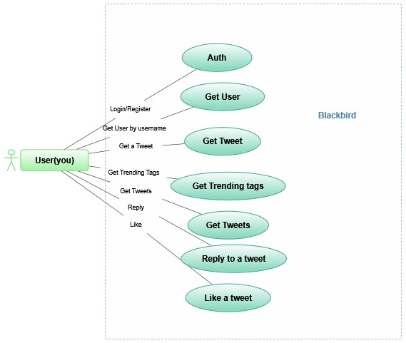

# Crow - Unofficial Twitter Client
## Whats Crow



Is an unofficial Twitter client written in selenium and node js. Keep in mind that everything is not done for you. 😄 So you to join the parts/blocks of code to achieve whatever outcome you want. 

Its more like a library where you are given classes(the blocks) and you have to join them in a certain way or configuration inorder to achieve your goal(a giant toy or robot or whatever) 

With that said i am not reponsible if you get suspended from twitter. Be a good netizen and follow the rules. Noobs! be careful

## How to Install
1. Clone the project

        git clone https://github.com/takumade/crow.git

2. Install node modules

        cd crow && npm install

3. Do some coding and play
        npm run start

## Important

Before you can you can do anything you need to first get a twitter client. A twitter client is a logged in user

1. Add your creds in `constants.ts`
```js
export const username = "username"
export const password = "password"
```

**The constants file contains many options that you may want to play with**

2. Now obtain a client and .....play

```js
import { TwitterClient } from "./classes/crow/twitter_client"

const getTweets = async () =>  {
   try{

        let client = new TwitterClient()
        let result = await client.getClient()
        
        if(result){
           // Do your stuff here
           
        }

    }catch(e){
        console.log(e)
    }
}
```


## Examples

**1. Get the current trends**

```js
// Get Twitter client first
let trends = await client.getTrends()        
```

**2. Tweet something**
```js
// Get Twitter client first
await client.tweet("Hello World! how are you");
```

**3. Like, Retweet and Reply a tweet**
```js

import { Tweet } from "./classes/crow/tweet"
...
// get client first 
let tweet = new Tweet(client.driver, <tweetUrl>)
await tweet.like()
await tweet.retweet()
await tweet.reply("Sounds Awesome!")
```

**4. Get user info**

```js
import User from "./classes/crow/user"
...
//get client first
let user = new User(client.driver, <username>)
let info = await user.getUserInfo()
```

**5. Follow user**

```js
import User from "./classes/crow/user"
...
//get client first
let user = new User(client.driver, <username>)
let info = await user.follow()
```

## Classes

`TwitterClient`

:: Deals mainly with logging you in and doing general stuff like getting tweets, trends

`Tweet`

:: Deals with a single tweet

`User`

:: Deals with a tweeter user


`Browser`

:: Has helper functions 


## Features

| Feature   |     Done      |  Is Working |
|----------|:-------------:|------:|
| Auth |  :ballot_box_with_check:| :ballot_box_with_check: |
| Get User |    :ballot_box_with_check:   |   :ballot_box_with_check: |
| Get User Followers |    :ballot_box_with_check:   |   :ballot_box_with_check: |
| Get User Following |    :ballot_box_with_check:   |   :ballot_box_with_check: |
| Follow User |    :ballot_box_with_check:   |   :ballot_box_with_check: |
| Unfollow User |    :ballot_box_with_check:  |   :ballot_box_with_check:|
| Get Trending |   :ballot_box_with_check:  |   :ballot_box_with_check: |
| Get Tweets |    :ballot_box_with_check:   |   :ballot_box_with_check: |
| Reply to a tweet |    :ballot_box_with_check:   |   :ballot_box_with_check: |
| Tweet a text message |    :ballot_box_with_check:   |   :ballot_box_with_check: |
| Like a tweet |    :ballot_box_with_check:  |   :ballot_box_with_check: |
| Delete a tweet |    :ballot_box_with_check:   |   :ballot_box_with_check: |
| Login with cookies |    :ballot_box_with_check:  |   :ballot_box_with_check: |
| Turn it into a package |    :ballot_box_with_check:   |   :ballot_box_with_check: |


## Contribution

So you want to contribute? Ok you are welcome to do so, just dont something that can be simply done but the current code. I will be rejecting bad and unclear code.


## Do you want to sponsor this, buy this or make it private

Do you wish to sponsor this project so it can continue getting the attention it needs?  Or you just want to buy it so it can be yours. Maybe you are twitter and you want this off the streets.

[Send Me a Whatsapp](https://wa.me/263778548832)  and lets talk. 
